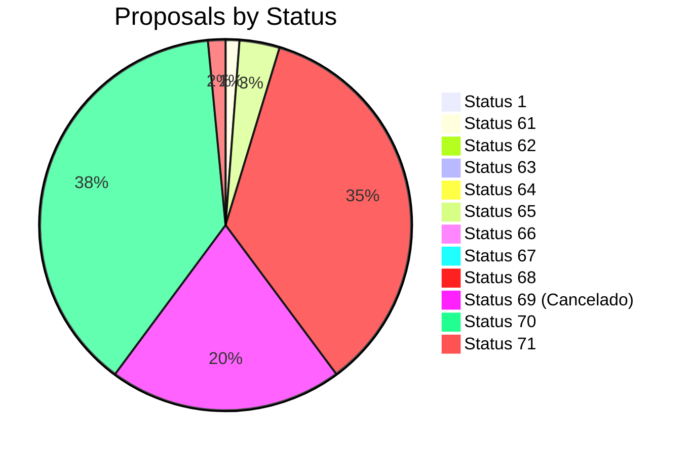

# Proposal Analysis Report

## 1. Last 10 Canceled Proposals (Status ID:69)
```json
[
  {
    "proposal_number": "B2502-21635A",
    "pps_id": 23178,
    "create_date": "2025-02-20 17:24:21"
  },
  {
    "proposal_number": "B2502-21610A",
    "pps_id": 23152,
    "create_date": "2025-02-20 15:32:06"
  },
  {
    "proposal_number": "B2502-21575A",
    "pps_id": 23117,
    "create_date": "2025-02-19 20:28:08"
  },
  {
    "proposal_number": "B2502-21523A",
    "pps_id": 23065,
    "create_date": "2025-02-19 15:13:10"
  },
  {
    "proposal_number": "B2502-21542B",
    "pps_id": 23084,
    "create_date": "2025-02-19 15:05:02"
  },
  {
    "proposal_number": "B2502-21473B",
    "pps_id": 23002,
    "create_date": "2025-02-18 19:12:00"
  },
  {
    "proposal_number": "B2502-21474B",
    "pps_id": 23003,
    "create_date": "2025-02-18 18:59:02"
  },
  {
    "proposal_number": "B2502-21432A",
    "pps_id": 22961,
    "create_date": "2025-02-18 15:41:23"
  },
  {
    "proposal_number": "B2502-21427A",
    "pps_id": 22956,
    "create_date": "2025-02-18 15:00:39"
  },
  {
    "proposal_number": "B2502-21415A",
    "pps_id": 22944,
    "create_date": "2025-02-18 13:42:59"
  }
]
```

## 2. Proposals by Status Count
| Status ID | Count |
|-----------|-------|
| 1         | 2     |
| 61        | 253   |
| 62        | 6     |
| 63        | 1     |
| 64        | 12    |
| 65        | 738   |
| 66        | 6     |
| 67        | 1     |
| 68        | 7422  |
| 69        | 4286  |
| 70        | 8096  |
| 71        | 321   |

**Mermaid Graph:**


## 3. Top 10 Proposals by Commission Total
| Proposal #       | Total Commission |
|------------------|-----------------:|
| B2402-2069A      |     600,000.00  |
| B2312-1076A      |      50,300.00  |
| B2309-337A       |      45,625.00  |
| B2309-239B       |      45,625.00  |
| B2312-954A       |      45,625.00  |
| B2401-1274A      |      45,625.00  |
| B2309-257A       |      45,625.00  |
| B2309-245A       |      45,625.00  |
| B2312-931A       |      45,625.00  |
| B2401-1286A      |      45,300.00  |

## SQL Queries Used
1. **Last 10 Canceled Proposals**:
```sql
SELECT pps_id, proposal_number, DATE_FORMAT(create_date, '%Y-%m-%d %H:%i:%s') AS create_date 
FROM proposal 
WHERE status_cla_id = 69 
ORDER BY create_date DESC LIMIT 10;
```

2. **Status Counts**:
```sql
SELECT status_cla_id, COUNT(*) as count 
FROM proposal 
GROUP BY status_cla_id;
```

3. **Top Commissions**:
```sql
SELECT p.pps_id, proposal_number, SUM(pc.value) AS total_commission 
FROM proposal p 
JOIN proposal_commission pc ON p.pps_id = pc.ppd_id 
GROUP BY p.pps_id 
ORDER BY total_commission DESC LIMIT 10;